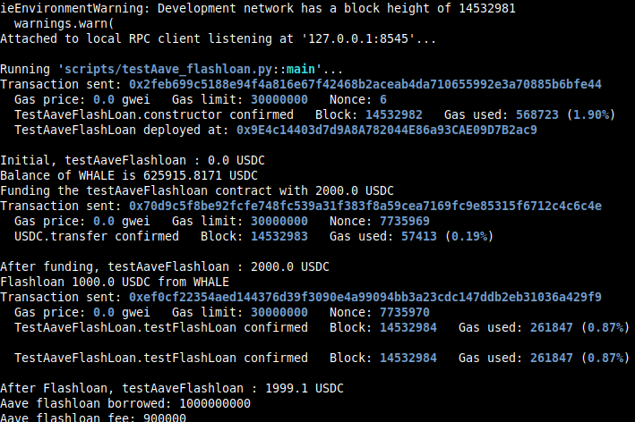

Study case of the Aave flashloan contract and functions, from [Solidity by Example site](https://github.com/t4sk/defi-by-example/blob/main/contracts/TestAaveFlashLoan.sol)

I use brownie to compile and deploy into hardhat in order to have the console.log feature.
You should start the hardhat node in another terminal and folder (`hh node`), then, in a terminal :

```bash
brownie compile
brownie run scripts/script.py
```

The brownie script demonstrate the flashloan on Aave V2 contracts:


